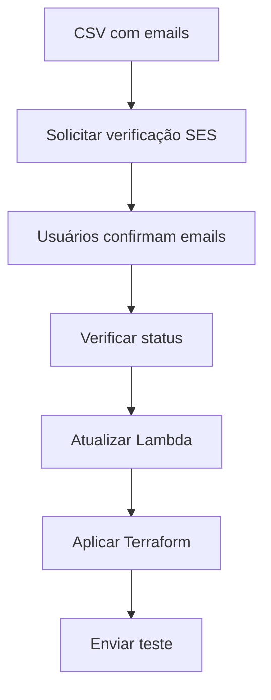

# 📧 Sistema de Verificação de Emails SES

Este script automatiza a verificação de emails no Amazon SES e integra com o Terraform para configurar a lista de emails autorizados na Lambda.

## 🚀 Uso Rápido

```bash
# 1. Criar template CSV
./setup_emails.sh --create-template

# 2. Editar o arquivo emails_teste.csv com seus emails

# 3. Solicitar verificação dos emails
./setup_emails.sh emails_teste.csv --verify-only

# 4. Verificar status após confirmação
./setup_emails.sh emails_teste.csv --check-status

# 5. Atualizar Lambda e executar Terraform
./setup_emails.sh emails_teste.csv --terraform-update

# 6. Enviar campanha de teste
./setup_emails.sh emails_teste.csv --send-test
```

## 📋 Formato do CSV

O arquivo CSV deve ter o seguinte formato:

```csv
email,nome,regiao,tipo_cliente
usuario@exemplo.com,Nome Completo,sudeste,premium
outro@exemplo.com,Outro Nome,sul,regiao_sul
geral@exemplo.com,Cliente Geral,nordeste,geral
```

### Tipos de Cliente

- `premium`: Clientes premium com benefícios especiais
- `regiao_sul`: Clientes da região Sul
- `geral`: Clientes gerais

### Regiões

- `norte`, `nordeste`, `centro-oeste`, `sudeste`, `sul`

## 🛠️ Comandos Disponíveis

| Comando | Descrição |
|---------|-----------|
| `--create-template` | Cria arquivo CSV template |
| `--verify-only` | Apenas solicita verificação no SES |
| `--check-status` | Verifica status de verificação |
| `--terraform-update` | Atualiza Lambda e aplica Terraform |
| `--send-test` | Envia campanha de teste |
| `--help` | Exibe ajuda completa |

## 📧 Processo de Verificação

1. **Solicitar Verificação**: O script envia email de verificação
2. **Confirmar Email**: Usuário clica no link recebido
3. **Verificar Status**: Script confirma se está verificado
4. **Atualizar Sistema**: Lambda é atualizada com emails verificados

## 🔄 Fluxo Completo



## 📁 Arquivos Gerados

- `verified_emails.json`: Lista de emails verificados/pendentes
- `lambda_function.py.backup.*`: Backup da Lambda original
- `cupons-api-postman-collection.json`: Collection Postman atualizada

## ⚠️ Pré-requisitos

- AWS CLI configurado (`aws configure`)
- Terraform instalado
- jq instalado (`sudo apt-get install jq`)
- Permissões SES na conta AWS

## 🔐 Sandbox Mode

O Amazon SES inicia em "sandbox mode":
- ✅ Pode enviar apenas para emails verificados
- ✅ Limite de 200 emails/dia
- ✅ Taxa máxima: 1 email/segundo

Para produção, solicite saída do sandbox mode na AWS Console.

## 🚨 Troubleshooting

### Email não verificado
```bash
# Verificar status específico
aws ses get-identity-verification-attributes --identities email@exemplo.com

# Re-enviar verificação
aws ses verify-email-identity --email-address email@exemplo.com
```

### Permissões negadas
```bash
# Verificar identidade AWS
aws sts get-caller-identity

# Verificar permissões SES
aws ses get-account-sending-enabled
```

### Lambda não atualizada
```bash
# Verificar se o arquivo existe
ls -la ../lambda/email_processor/lambda_function.py

# Aplicar Terraform manualmente
terraform plan
terraform apply
```

## 📊 Monitoramento

```bash
# Verificar quota SES
aws ses get-send-quota

# Estatísticas de envio
aws ses get-send-statistics

# Logs da Lambda
aws logs get-log-events --log-group-name "/aws/lambda/email-send"
```

## 🎯 Exemplos de Uso

### Verificação Inicial
```bash
./setup_emails.sh emails_teste.csv --verify-only
```

### Deploy Completo
```bash
./setup_emails.sh emails_teste.csv --terraform-update --send-test
```

### Apenas Teste
```bash
./setup_emails.sh emails_teste.csv --send-test
```